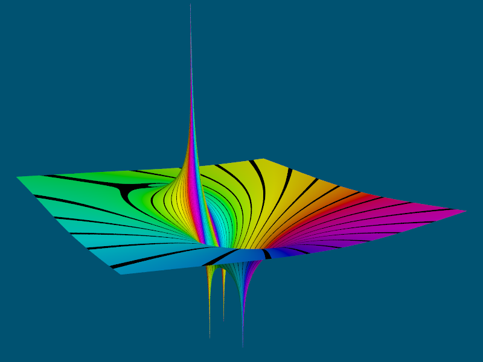
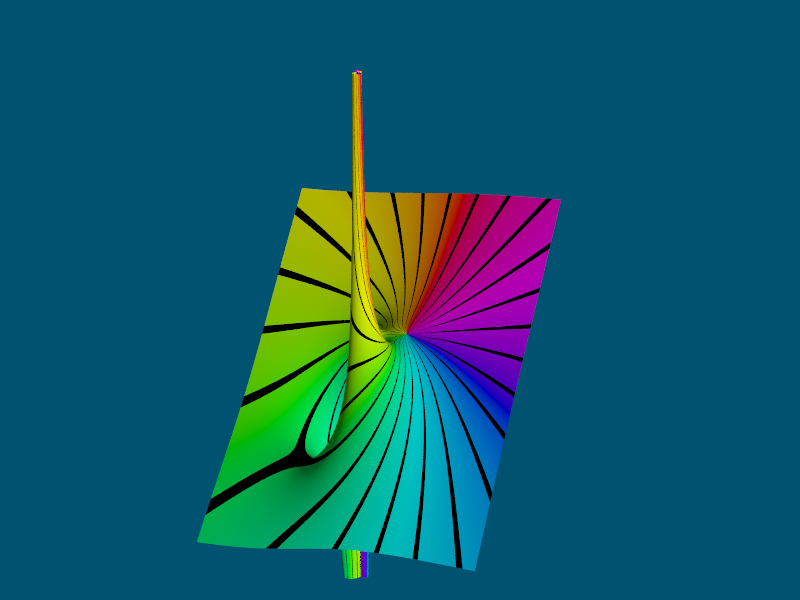
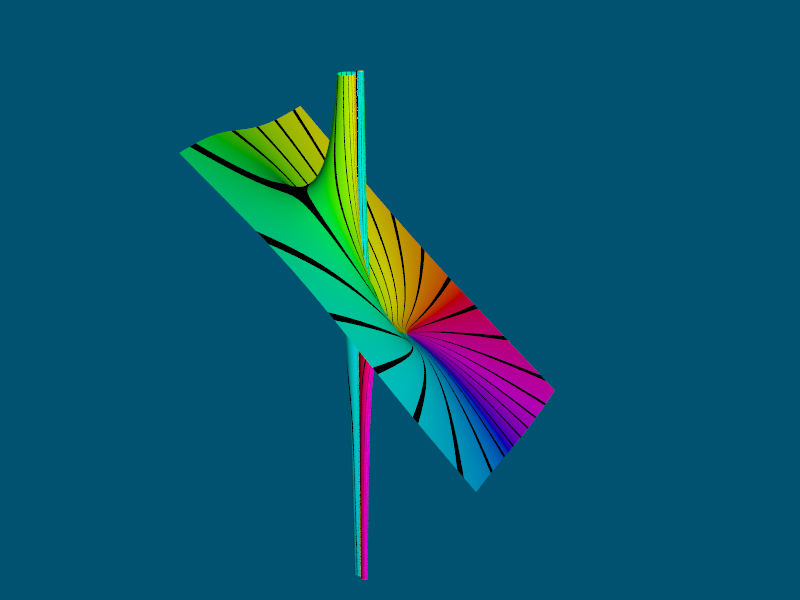

# POV-Ray-complex-functions
[POV-Ray](http://www.povray.org) v3.7 include file for working with complex functions

[List](OPERATORS.md) of available complex operators

## Images created with the examples:

```
j = Sqrt(-1)
Z = re + im*j
Re(Z) = re
Im(Z) = im
|Z| = Sqrt(re^2 + im^2)
```

### Isosurface with domain colors of complex function
### Fn(Z) = 1/(Z^5 - 2)^2

| x-axis |  y-axis   | z-axis |
| ------ | --------- | ------ |
|   re   | \|Fn(Z)\| |   im   |

[Source code](FivePoles_Isosurface.pov)\


### Mesh with domain colors of complex function
### Fn(Z) = (Z^2 + 1)/(Z^2 - 1)

| x-axis |  y-axis   | z-axis |
| ------ | --------- | ------ |
|   re   | \|Fn(Z)\| |   im   |

[Source code](Two_Zeros_Two_Poles.pov)\


### Mesh with domain colors of complex function
### Fn(Z) = (-Z^3 + Z^2*j + 1)/(Z - 1 + j)^2

| x-axis |     y-axis    | z-axis |
| ------ | ------------- | ------ |
|   re   | Ln(\|Fn(Z)\|) |   im   |

[Source code](HueStripes_MagnHeight.pov)\


### Plane with domain colors of complex function (Ln magnitude scale)
### Fn(Z) = (-Z^3 + Z^2*j + 1)/(Z - 1 + j)^2

| x-axis | z-axis |
| ------ | ------ |
|   re   |   im   |

[Source code](HueRamps_MagnRamps.pov)\


### Plane with domain colors of complex function (Ln magnitude scale)
### Fn(Z) = (-Z^3 + Z^2*j + 1)/(Z - 1 + j)^2

| x-axis | z-axis |
| ------ | ------ |
|   re   |   im   |

[Source code](HueRamps_MagnStripes.pov)\


### Plane with domain colors of complex function (Ln magnitude scale)
### Fn(Z) = (-Z^3 + Z^2*j + 1)/(Z - 1 + j)^2

| x-axis | z-axis |
| ------ | ------ |
|   re   |   im   |

[Source code](HueStripes_MagnRamps.pov)\


### Plane with domain colors of complex function (Ln magnitude scale)
### Fn(Z) = (-Z^3 + Z^2*j + 1)/(Z - 1 + j)^2

| x-axis | z-axis |
| ------ | ------ |
|   re   |   im   |

[Source code](HueStripes_MagnStripes.pov)\


### Mesh with domain colors of magnitude of complex function
### Fn(Z) = (-Z^3 + Z^2*j + 1)/(Z - 1 + j)^2

| x-axis |  y-axis   | z-axis |
| ------ | --------- | ------ |
|   re   | \|Fn(Z)\| |   im   |

[Source code](HueStripes_MagnHeight_NonLn_Magn.pov)\


### Mesh with domain colors of real part of complex function
### Fn(Z) = (-Z^3 + Z^2*j + 1)/(Z - 1 + j)^2

| x-axis |   y-axis   | z-axis |
| ------ | ---------- | ------ |
|   re   | Re(Fn(Z))  |   im   |

[Source code](HueStripes_MagnHeight_NonLn_Real.pov)\


### Mesh with domain colors of imaginary part of complex function
### Fn(Z) = (-Z^3 + Z^2*j + 1)/(Z - 1 + j)^2

| x-axis |   y-axis   | z-axis |
| ------ | ---------- | ------ |
|   re   | Im(Fn(Z))  |   im   |

[Source code](HueStripes_MagnHeight_NonLn_Imag.pov)\

