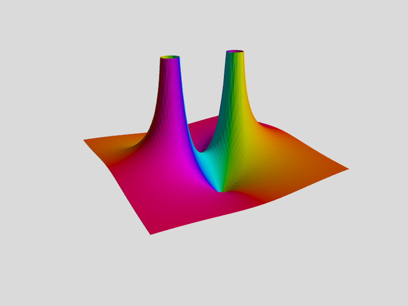
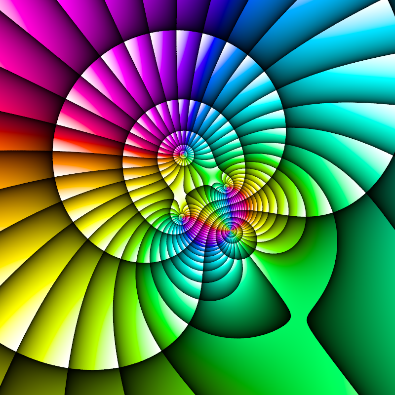
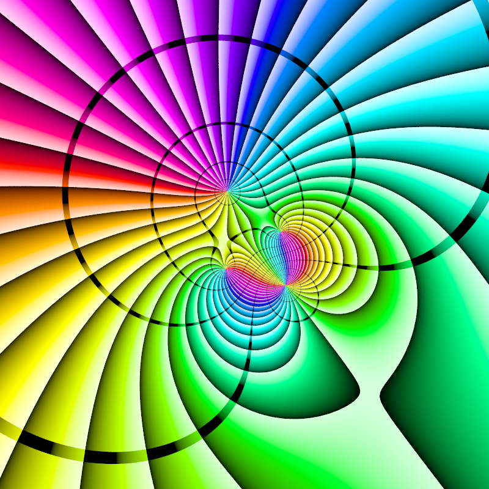
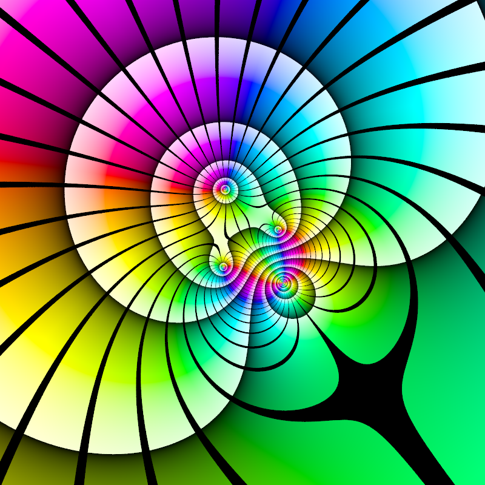
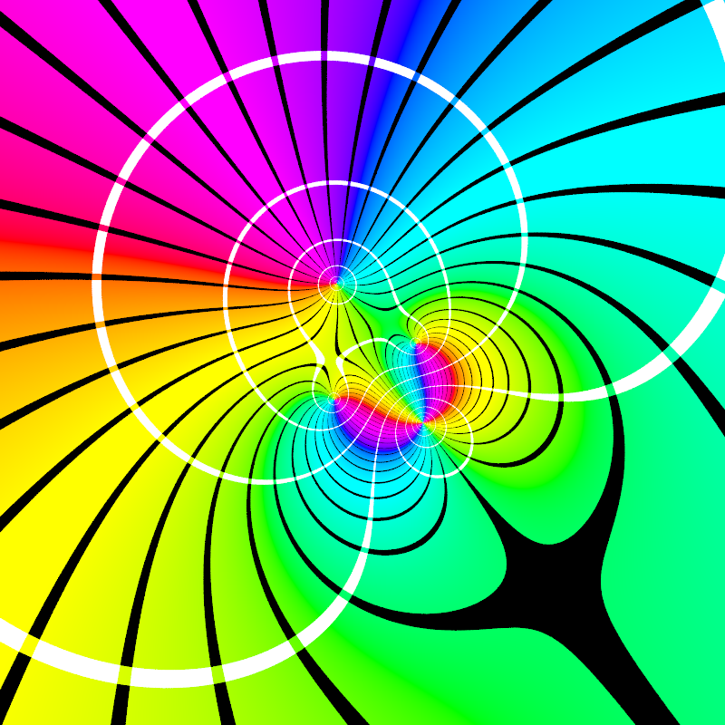

# POV-Ray-complex-functions
[POV-Ray](http://www.povray.org) v3.7 include file for working with complex functions

## Images created with the examples:

### Isosurface with domain colors of complex function with 5 poles
[Source code](FivePoles_Isosurface.pov)\

### Mesh with domain colors of complex function with 2 zeros and 2 poles
[Source code](Two_Zeros_Two_Poles.pov)\

### Plane with domain colors of complex function with 3 zeros and 1 pole
[Source code](HueRamps_MagnRamps.pov)\

### Plane with domain colors of complex function with 3 zeros and 1 pole
[Source code](HueRamps_MagnStripes.pov)\

### Plane with domain colors of complex function with 3 zeros and 1 pole
[Source code](HueStripes_MagnRamps.pov)\

### Plane with domain colors of complex function with 3 zeros and 1 pole
[Source code](HueStripes_MagnStripes.pov)\

