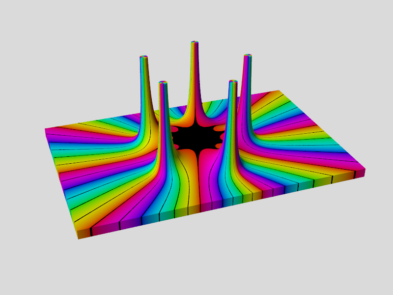
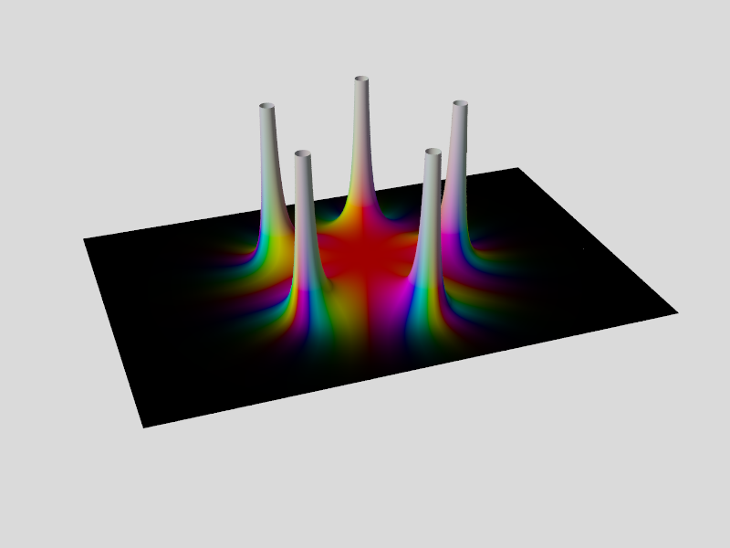
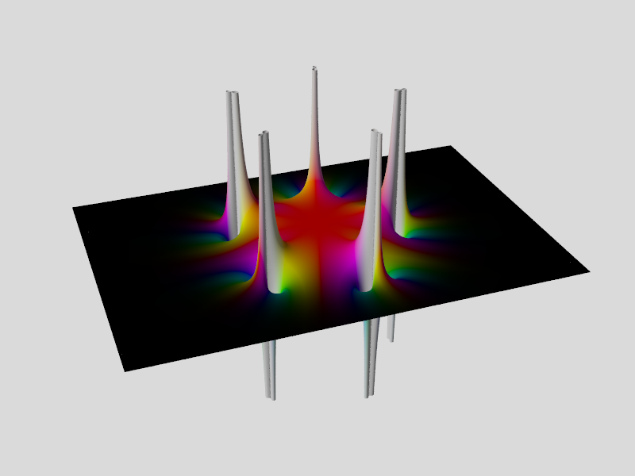
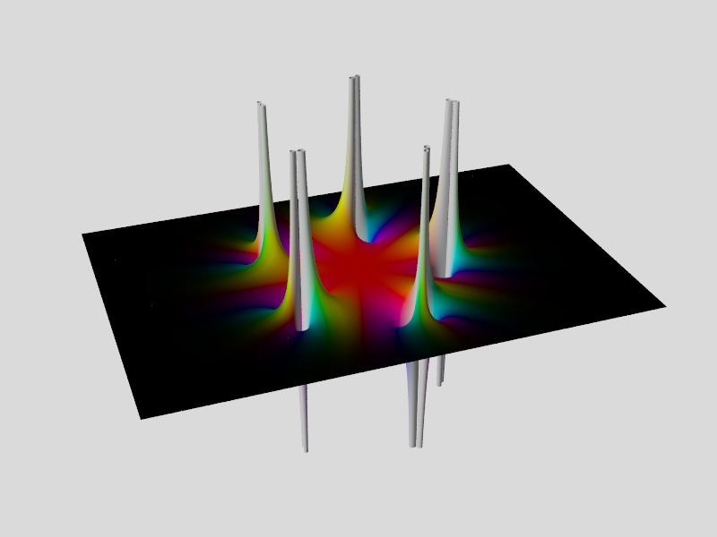
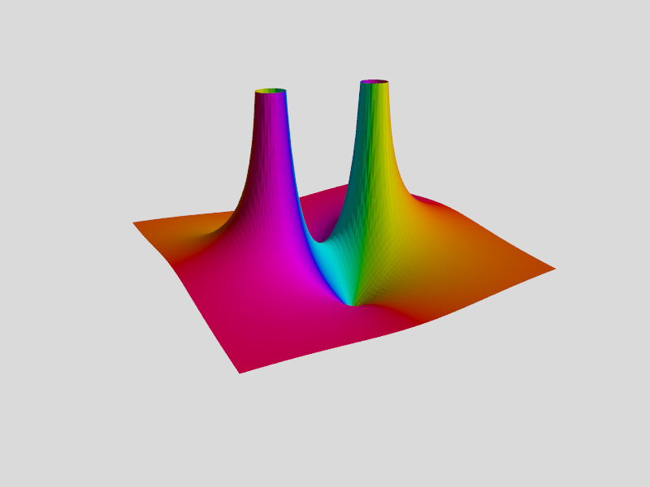
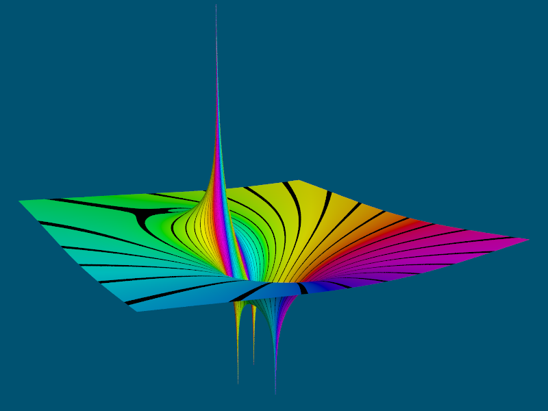
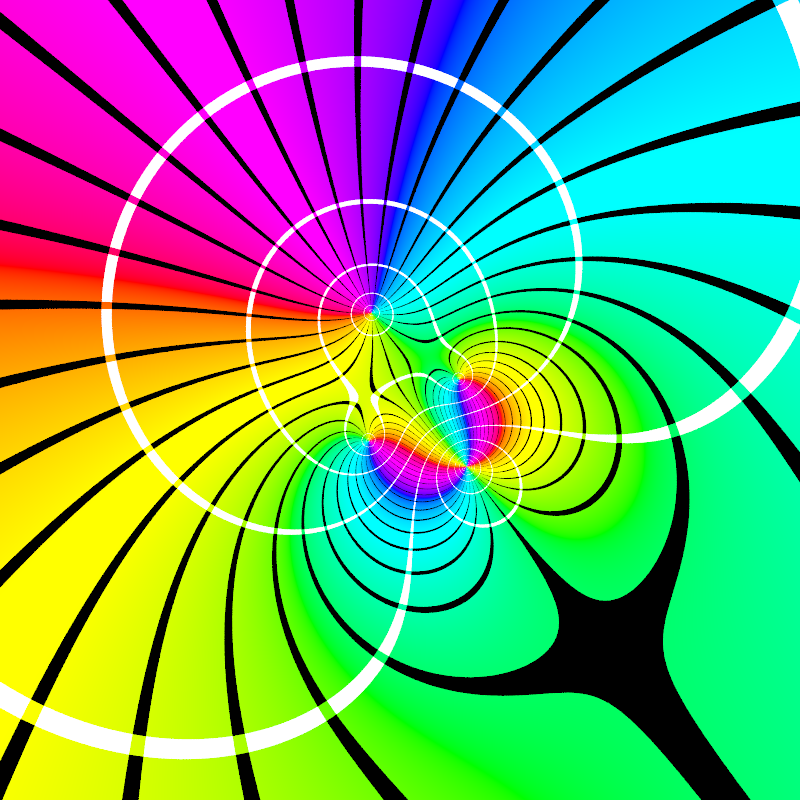
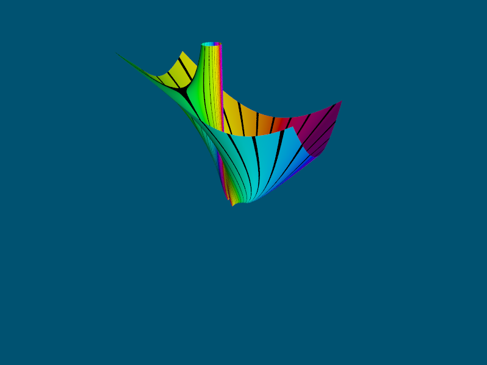
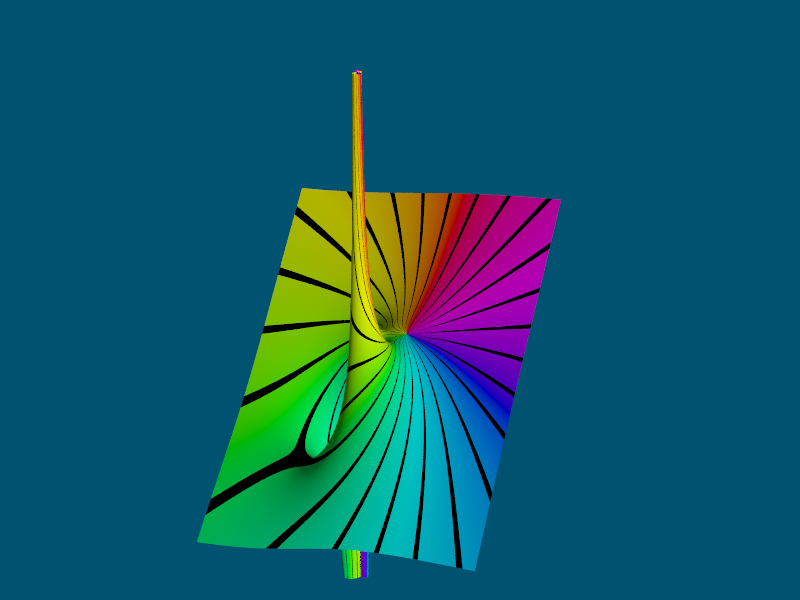
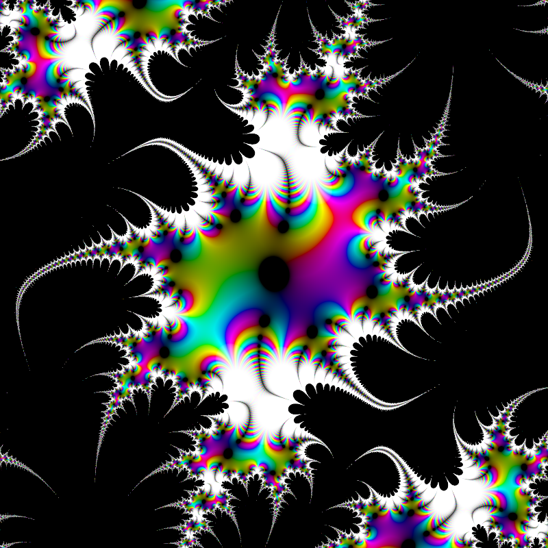

# POV-Ray-complex-functions
[POV-Ray](http://www.povray.org) v3.7 include file for working with complex functions

[List](OPERATORS.md) of available complex operators

## Images created with the examples:

```
j = Sqrt(-1)
Z = re + im*j
Re(Z) = re
Im(Z) = im
|Z| = Sqrt(re^2 + im^2)
```

### Isosurface with domain colors of a complex function
### F(Z) = 1/(Z<sup>5</sup> - 2)<sup>2</sup>

| x-axis |  y-axis   | z-axis |
| ------ | --------- | ------ |
|   re   | \|Fn(Z)\| |   im   |

[Source code](Examples/FivePoles_Isosurface.pov)\


### Mesh with domain colors of a complex function
### F(Z) = 1/(Z<sup>5</sup> - 2)<sup>2</sup>

| x-axis |  y-axis   | z-axis |
| ------ | --------- | ------ |
|   re   | \|Fn(Z)\| |   im   |

[Source code](Examples/FivePoles_ClippedMesh2_Magn.pov)\


### Mesh with domain colors of a complex function
### F(Z) = 1/(Z<sup>5</sup> - 2)<sup>2</sup>

| x-axis |  y-axis   | z-axis |
| ------ | --------- | ------ |
|   re   | Re(Fn(Z)) |   im   |

[Source code](Examples/FivePoles_ClippedMesh2_Real.pov)\


### Mesh with domain colors of a complex function
### F(Z) = 1/(Z<sup>5</sup> - 2)<sup>2</sup>

| x-axis |  y-axis   | z-axis |
| ------ | --------- | ------ |
|   re   | Im(Fn(Z)) |   im   |

[Source code](Examples/FivePoles_ClippedMesh2_Imag.pov)\


### Mesh with domain colors of a complex function
### F(Z) = (Z<sup>2</sup> + 1)/(Z<sup>2</sup> - 1)

| x-axis |  y-axis   | z-axis |
| ------ | --------- | ------ |
|   re   | \|Fn(Z)\| |   im   |

[Source code](Examples/Two_Zeros_Two_Poles.pov)\


### Mesh with domain colors of a complex function
### F(Z) = (-Z<sup>3</sup> + Z<sup>2</sup>*j + 1)/(Z - 1 + j)<sup>2</sup>

| x-axis |     y-axis    | z-axis |
| ------ | ------------- | ------ |
|   re   | Ln(\|Fn(Z)\|) |   im   |

[Source code](Examples/HueStripes_MagnHeight.pov)\


### Plane with domain colors of a complex function (Ln magnitude scale)
### F(Z) = (-Z<sup>3</sup> + Z<sup>2</sup>*j + 1)/(Z - 1 + j)<sup>2</sup>

| x-axis | z-axis |
| ------ | ------ |
|   re   |   im   |

[Source code](Examples/HueRamps_MagnRamps.pov)\


### Plane with domain colors of a complex function (Ln magnitude scale)
### F(Z) = (-Z<sup>3</sup> + Z<sup>2</sup>*j + 1)/(Z - 1 + j)<sup>2</sup>

| x-axis | z-axis |
| ------ | ------ |
|   re   |   im   |

[Source code](Examples/HueRamps_MagnStripes.pov)\


### Plane with domain colors of a complex function (Ln magnitude scale)
### F(Z) = (-Z<sup>3</sup> + Z<sup>2</sup>*j + 1)/(Z - 1 + j)<sup>2</sup>

| x-axis | z-axis |
| ------ | ------ |
|   re   |   im   |

[Source code](Examples/HueStripes_MagnRamps.pov)\


### Plane with domain colors of a complex function (Ln magnitude scale)
### F(Z) = (-Z<sup>3</sup> + Z<sup>2</sup>*j + 1)/(Z - 1 + j)<sup>2</sup>

| x-axis | z-axis |
| ------ | ------ |
|   re   |   im   |

[Source code](Examples/HueStripes_MagnStripes.pov)\


### Mesh with domain colors of magnitude of a complex function
### F(Z) = (-Z<sup>3</sup> + Z<sup>2</sup>*j + 1)/(Z - 1 + j)<sup>2</sup>

| x-axis |  y-axis   | z-axis |
| ------ | --------- | ------ |
|   re   | \|Fn(Z)\| |   im   |

[Source code](Examples/HueStripes_MagnHeight_NonLn.pov)\


### Mesh with domain colors of real part of a complex function
### F(Z) = (-Z<sup>3</sup> + Z<sup>2</sup>*j + 1)/(Z - 1 + j)<sup>2</sup>

| x-axis |   y-axis   | z-axis |
| ------ | ---------- | ------ |
|   re   | Re(Fn(Z))  |   im   |

[Source code](Examples/HueStripes_RealHeight_NonLn.pov)\


### Mesh with domain colors of imaginary part of a complex function
### F(Z) = (-Z<sup>3</sup> + Z<sup>2</sup>*j + 1)/(Z - 1 + j)<sup>2</sup>

| x-axis |   y-axis   | z-axis |
| ------ | ---------- | ------ |
|   re   | Im(Fn(Z))  |   im   |

[Source code](Examples/HueStripes_ImagHeight_NonLn.pov)\


### Plane with domain colors of the 7th iterate of a complex function (Ln magnitude scale)
### G(Z) = (1 + j)*Sin(Z)
### F(Z) = G<sup>7</sup>(Z) = G(G(G(G(G(G(G(Z)))))))

| x-axis | z-axis |
| ------ | ------ |
|   re   |   im   |

[Source code](Examples/Iterated_Sine.pov)\

